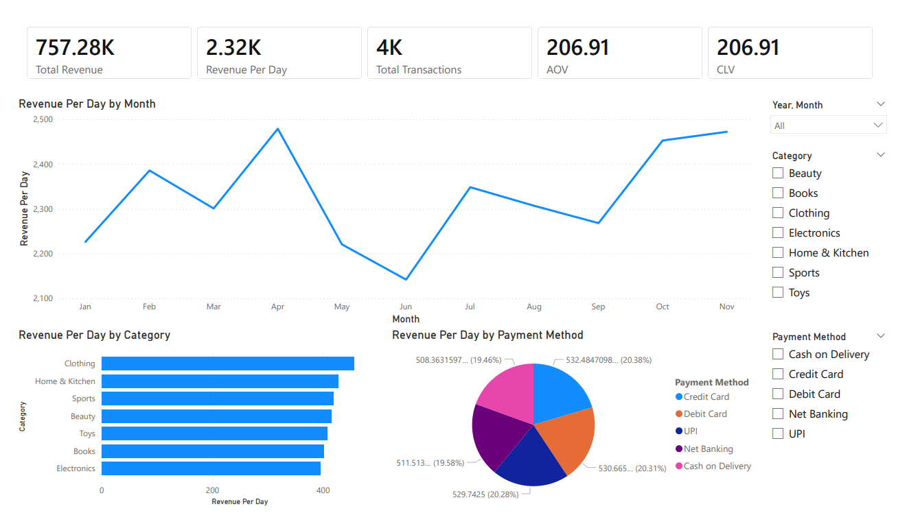
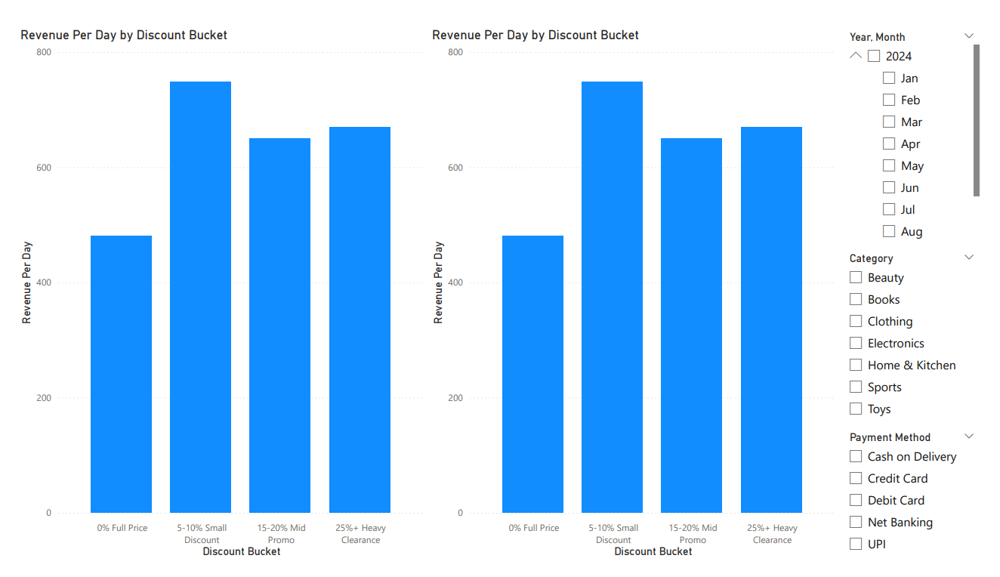

# E-Commerce-Data-Analysis

This project analyzes an e-commerce dataset using SQL for data validation and analysis, and Power BI for interactive reporting.  
The goal is to explore sales performance and discount impact, and to demonstrate data cleaning, KPI design, and business insight generation.

---

## 📌 Project Overview

This project simulates a real-world e-commerce analytics task.  
SQL is used to validate and analyze the dataset, and Power BI is used to build an interactive business intelligence report.

---

## 🛠 Tools Used

- SQL (PostgreSQL) – Data validation and analysis  
- Power BI Desktop – Data visualization and dashboard  
- GitHub – Documentation and project sharing  

---

## 📂 Dataset

The dataset contains transaction-level e-commerce data with the following fields:

- user_id  
- product_id  
- category  
- price  
- discount  
- final_price  
- payment_method  
- purchase_date  

Currency: Indian Rupees (₹)

📁 CSV file: [View CSV File](Data/E-Commerce_Dataset.csv)

---

## 🧹 Data Validation (SQL)

The following data quality checks were performed:

- Missing values check  
- Negative and zero price validation  
- Discount range validation (0–100%)  
- Final price calculation consistency check  
- Duplicate transaction detection  
- Data type validation  
- Date range validation  

**Validation Outcome:**  
The dataset passed all validation checks with no missing values, invalid discounts, or inconsistent pricing logic detected.

## 📊 Data Analysis (SQL)

Key analyses performed:

- Monthly revenue trend and growth analysis  
- Customer Lifetime Value (CLV) estimation  
- Revenue distribution by product category  
- Payment method usage analysis  
- Discount impact on sales volume and revenue  

📁 SQL file: [View SQL File](SQL/E-Commerce_SQL_Data_Analysis.pgsql)

---

## 📈 Power BI Report

The Power BI report contains two pages:

### 1️⃣ Sales Performance  
- Total revenue
- Revenue per day
- Total transactions  
- Average Order Value (AOV)  
- Customer Lifetime Value (CLV)  
- Revenue per day by month  
- Revenue per day by category  
- Revenue per day by payment method  

### 2️⃣ Discount Strategy Analysis  
- Revenue per day by discount bucket  
- Total transactions by discount bucket  

📁 Power BI file: [📊 View Power BI Report](Power_BI/E-Commerce_Power_BI.pbix)

📁 PDF export: [📄 View Project Report (PDF)](Power_BI/E-Commerce_Report.pdf)

---

## 🖼 Dashboard Screenshots

### Sales Performance

### Discount Impact

---

## 💡 Key Business Insights

### 📈 Revenue Trend 
- Top-performing months by daily revenue are April (₹2,478/day), November (₹2,472/day), and October (₹2,452/day).  
- The largest daily growth occurred in July (+9.6%), October (+8.1%), and April (+7.7%).  
- A seasonal dip was observed in May and June, with June showing the lowest daily revenue (₹2,141/day).  
- Overall revenue is stable between ₹2,200–₹2,470 per day, indicating consistent business performance.  

### 👤 Customer Lifetime Value (CLV)
- All customers made only one purchase during the period, indicating zero retention.  
- CLV is equal to AOV (₹206.91), showing the business relies heavily on acquiring new customers rather than repeat purchases.  

### 🛍 Revenue by Category
- Clothing is the top-performing category, contributing 15.2% of total revenue with the highest average transaction value.  
- Home & Kitchen has the highest transaction volume but lower average spend.  
- Revenue distribution across categories is balanced, reducing dependency on a single product segment.  

### 💳 Payment Method Analysis
- Credit cards are the most popular payment method, contributing 20.8% of transactions and the highest revenue.  
- Cash on Delivery (COD) has the highest average transaction value, despite lower usage.  
- Average transaction value is consistent across payment methods, indicating stable customer spending behavior.  

### 🎯 Discount Strategy Analysis
- Higher discounts increase sales volume but reduce average transaction value.  
- The 5–10% discount tier generates the highest daily revenue, representing the most effective pricing strategy.  
- Heavy discounts (25%+) increase transactions but reduce revenue efficiency.  
- Full-price purchases have the highest average spend, indicating a premium customer segment with strong price tolerance.  

---
